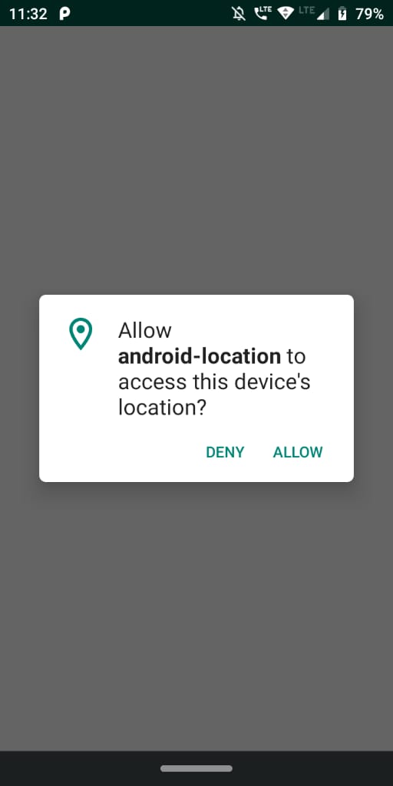
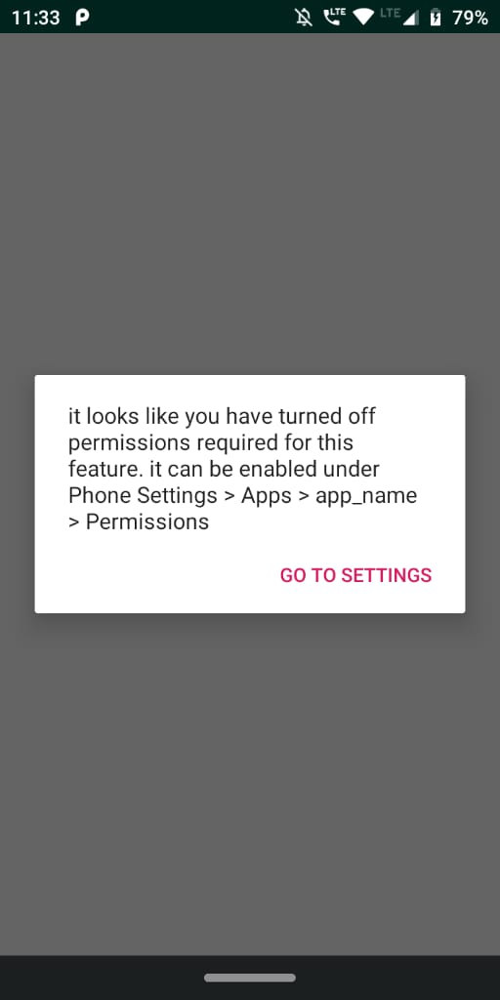
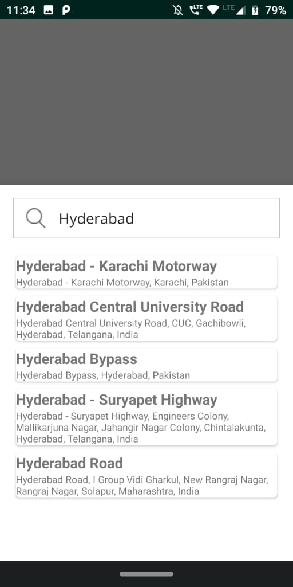
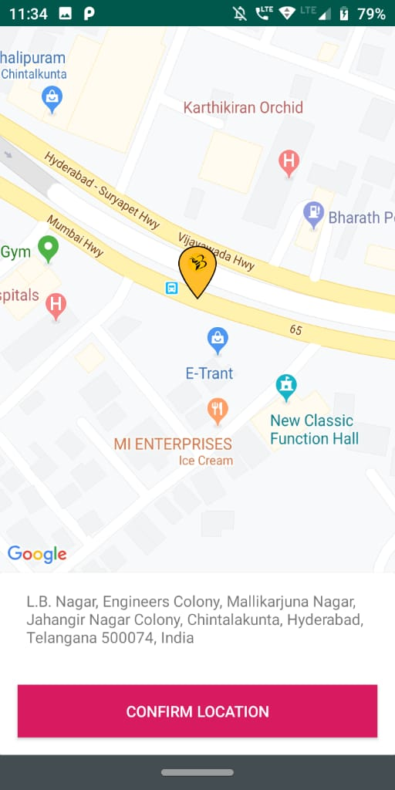
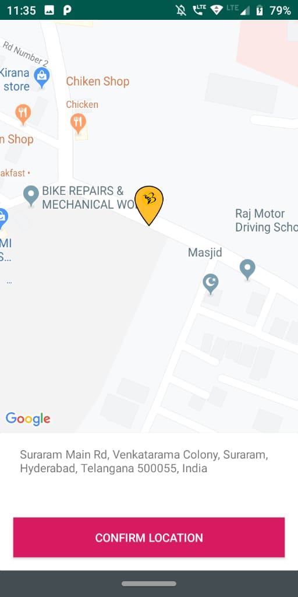

# android-location

handling the location permission in android in professional way with good UX

please add your google maps API key in app/src/debug/res/values/google_maps_api.xml

#### Screenshots

<table>
   <tr>
     <td><kbd></kbd></td>
     <td><kbd></kbd></td>
     <td><kbd></kbd></td>
     <tr> 
      <td><kbd></kbd></td>
     <td><kbd></kbd></td>
     <td><kbd></kbd></td>
    </tr>
</table>
